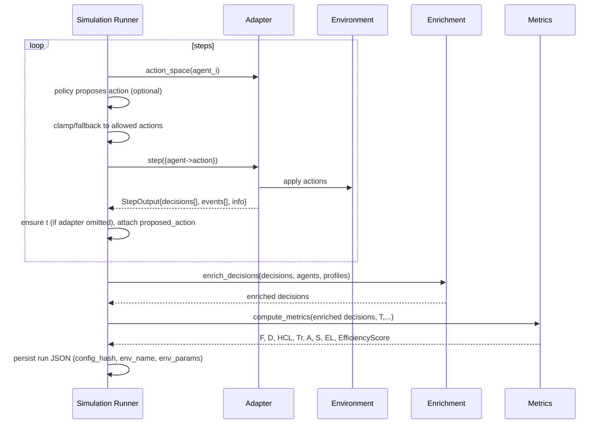
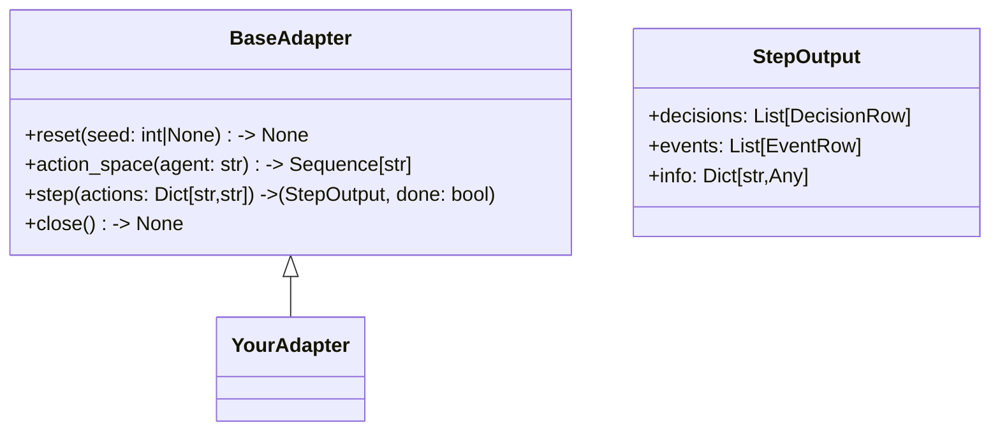
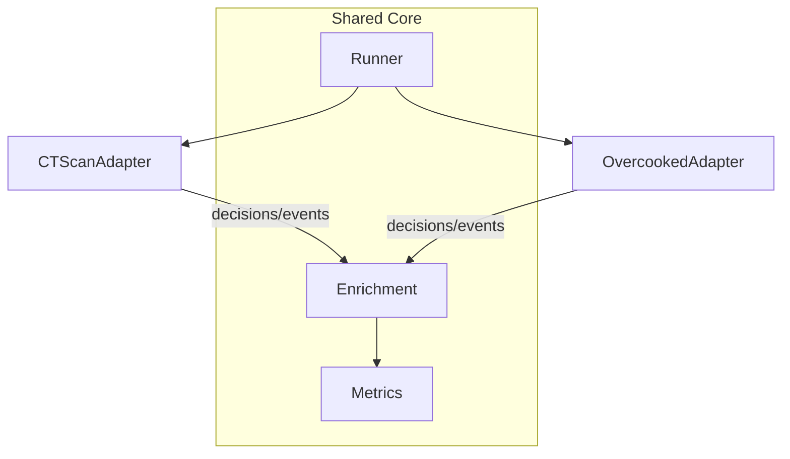

# Simulator Architecture & Adapter Guide

This doc gives diagrams and talking points for devs and users. It shows the logic, core components, how we stay general across scenarios (CT, Overcooked, …), and where adapters plug in.

---

## 1) High‑Level System (one slide)

```mermaid
flowchart LR
  U[User] --> FE[Frontend]
  FE -->|POST /api/v1/simulator/simulate?name=...| API[Backend API]
  API --> SR[Simulation Runner]
  SR <-->|read| CFG[Config YAML]
  SR -->|create_adapter(env_name)| REG[Adapter Registry]
  REG --> ADP[Adapter (env-specific)]
  ADP --> ENV[Environment/Sim]
  SR --> ENR[Enrichment]
  SR --> MET[Metrics]
  SR -->|write JSON| OUT[metrics/<task>_full_<ts>.json]
  FE -->|GET /metrics, /load_metrics| API
  API --> FE
```

**Key messages:**

* The **only env-specific piece** is the `Adapter` returned by the registry.
* Everything else (Runner, Enrichment, Metrics, API) is **environment-agnostic**.
* Artifacts (decisions + metrics) are written to `metrics/` for traceability.

---

## 2) Run Loop Logic (generic across scenarios)



**Notes:**

* Policies are optional; runner falls back to random/first valid action.
* `proposed_action` enables **off-role** detection and **surrogate comparison**.

---

## 3) Config Normalization (back‑compat → canonical)

```mermaid
flowchart TD
  raw[User/Legacy Config]
  raw --> NORM[_normalize_params()]
  NORM -->|environment, env_params, dt, baseline_s, rt_max| TASK[(task.parameters)]
  TASK --> YAML[Canonical YAML]
```

**Canonical `task.parameters`:**

```yaml
parameters:
  environment: ct_scan | overcooked | your_env
  env_params: { ... }      # env-specific knobs only
  dt: 0.1                  # synth clock if adapter omits t
  baseline_s: 30           # optional
  rt_max: 5.0              # optional
```

---

## 4) Adapter Interface (what devs implement)



**DecisionRow (minimal):**

```json
{
  "t": 1.23,                      // adapter may omit; runner will synthesize
  "agent": "RadiologistAssistant",
  "action": "finalize_report",
  "correct": true,                // if adapter can judge
  "probs": {"finalize_report":0.8, "dictate_note":0.2}, // optional
  "surrogate_action": "dictate_note",                     // optional
  "surrogate_probs": {...},                                // optional
  "latency_ms": 240,             // optional
  "duration_s": 0.05             // optional
}
```

**EventRow (optional, env/system events):**

```json
{
  "t": 1.4,
  "event_type": "checklist_progress", // or "progress"
  "progress": 0.6
}
```

---

## 5) Where “correct” & “surrogate\_\*” come from

* **Adapter decides correctness** when the env has ground‑truth (e.g., Overcooked delivering soup at the right station, CT adapter verifying step order).
* **Adapter can emit surrogate** outputs to reflect a known baseline/bot:

  * `surrogate_action`: what a baseline would have done.
  * `surrogate_probs`: distribution over actions (if available).
* Metrics use these fields to compute:

  * **Tr** (task reliability) via `correct`/`event_type:error`.
  * **S** (surrogate similarity) via KL(P\_human||P\_surrogate) or action match.

**Why in the adapter?** Because correctness and surrogate behavior are **domain‑specific** and require environment semantics the runner does not know.

---

## 6) Enrichment (domain-agnostic)

```mermaid
flowchart LR
  D[Adapter decisions[]] --> ENR[enrich_decisions]
  A[agents] --> ENR
  P[profiles] --> ENR
  ENR --> D2[decisions with\nactor_type, latency_ms, duration_s,\nai_suggested, human_accepted,\nsuccessful_outcome, unsafe_event,\nmanual_intervention, off_role_action]
```

**Highlights:**

* **actor\_type** inferred from agent name (“bot/assistant”) or forced map.
* **off\_role\_action**: proposed vs. agent’s declared `action_space`.
* Deterministic with `seed` for reproducible demos.

---

## 7) Metrics (scenario-agnostic)

* **F**: interactions/minute
* **D**: mean action duration (prefers `duration_s`, fallback to `latency_ms`)
* **HCL**: 1 − meanRT/rt\_max (humans preferred; else overall)
* **Tr**: 1 − errors/N (`correct==False` or `event_type=="error"`)
* **A**: adaptability between early vs. late segments
* **S**: surrogate similarity (KL if probs, else action match)
* **EL**: efficiency loss vs. baseline\_s
* **EfficiencyScore**: shaped EL with light penalties/bonuses:

  * − off‑role rate (penalty)
  * * progress rate (bonus)

---

## 8) Generality & Adaptiveness (CT vs Overcooked)



**Takeaway:** Adding a new domain requires **only** a new adapter; everything else stays unchanged.

---

## 9) How to add a new environment (dev handout)

1. **Create** `haic_env_builder/adapters/<your_env>_adapter.py` implementing `BaseAdapter`.
2. **Register** it in `adapters/registry.py` under a short name (e.g., `"warehouse"`).
3. **Emit** `decisions[]` and, if applicable, `events[]`:

   * Include `correct`, `probs`, `surrogate_action`, `surrogate_probs` when you can.
   * If you don’t provide `t`, the runner will synthesize via `dt`.
4. **Provide** `action_space(agent)`; it drives policy clamping & off‑role detection.
5. **Config**: set `task.parameters.environment = "your_env"` and your `env_params`.

**Adapter skeleton:**

```python
class YourAdapter(BaseAdapter):
    def __init__(self, **env_params):
        self.params = env_params
        # init your env here

    def reset(self, seed: int|None=None):
        # reset env to initial state
        pass

    def action_space(self, agent: str) -> Sequence[str]:
        return ("ACTION_A", "ACTION_B")

    def step(self, actions: Dict[str,str]) -> tuple[StepOutput, bool]:
        # apply actions, advance env
        decisions = [{
          "agent": "agent_0", "action": actions["agent_0"],
          # optionally: t, correct, probs, surrogate_* , latency_ms, duration_s
        }]
        events = [{"event_type": "progress", "progress": 0.25}]  # optional
        info = {"score": 1}
        done = False
        return StepOutput(decisions, events, info), done
```

---

## 10) Appendix – Mini Examples

**CT `env_params` example**

```yaml
env_params:
  steps: 12
  checklist: [open_study, select_series, scroll_slice, finalize_report]
  surrogate: "checklist_bot"
```

**Overcooked `env_params` example**

```yaml
env_params:
  layout_name: "cramped_room"
  horizon_s: 30
  surrogate: "stay_put"
```

---
