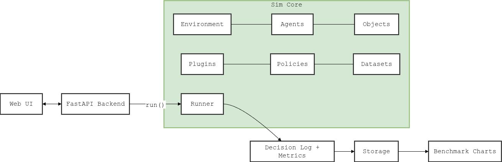

# HAIC Simulation MVP

A minimal, extensible engine to prototype Human–AI Collaboration (HAIC) scenarios, run scripted or dataset-driven simulations, and produce comparable logs & metrics before production.

## Folder Structure

```bash
├── configs
│   ├── ct_demo.json           # scripted demo (radiology)
│   └── sample_cases.csv       # toy dataset for A/B experiments
├── engine
│   ├── base.py                # Entity, Agent, Object, Environment, Decision
│   ├── datasets.py            # CSV loader + dataset → script generator
│   ├── evaluate.py            # accuracy, defer rate, latency, etc.
│   ├── plugins.py             # class registry + dynamic import
│   ├── policies.py            # Threshold (baseline), L2D-like (defer)
│   └── run_sim.py             # runner: execute script, emit logs
├── schemas
│   └── decision_schema.json   # output log schema (draft)
├── tools
│   └── run_dataset_experiment.py  # A/B experiments via dataset
└── user_plugins
    └── medical.py             # example domain plugin (Radiologist, CTImage)

```

## Why this exists

Teams need a safe way to dry-run human–AI workflows with real or synthetic data and measure if a policy or UI change helps. This MVP provides a small core (Environment · Agents · Objects · Runner) with plugins, dataset→script generation, policies (baseline / L2D-like), and logs + metrics that are comparable and easy to plug into your backend & charts.

## High-Level Architecture




## Quick Start

Assumes Python 3.10+ and a virtualenv.

```bash
# 1) Create & activate venv (recommended)
python3 -m venv .venv && source .venv/bin/activate

# 2) Install dependencies 
pip install -r requirements.txt


# 3) Run the scripted demo (Radiology)
python -c "import json; from engine.run_sim import run_from_config; \
print(run_from_config(json.load(open('configs/ct_demo.json')), results_dir='results'))"

# 4) Run dataset-driven A/B experiments
python -m tools.run_dataset_experiment --dataset configs/sample_cases.csv --mode baseline
python -m tools.run_dataset_experiment --dataset configs/sample_cases.csv --mode l2d
```

Outputs are written to `results/`:

- `*.json` — full decision log including entities, steps, effects

- `*_metrics.json` (for experiments) — accuracy, AI/Human accuracy, defer_rate, avg_latency_ms

## Core Concepts

- **Environment**: container of agents/objects, high-level attributes (task, domain), log sink.

- **Agent**: actor (human, AI, surrogate) with affordances (allowed actions).

- **Object**: thing in the world (UI element, image, tool) with affordances.

- **Affordances**: allowed actions per Agent/Object; the runner blocks illegal actions.

- **Policy**: decision logic (e.g., Threshold, L2D-like defer to human).

- **Script**: ordered steps {t, agent, action, object, effect?, correct?, latency_ms?}.

- **Dataset→Script**: turn rows (ai_prob, ground_truth, …) into steps with policy gating.

## Configuration Reference (scripted run)

Minimal JSON schema (keys actually used):

```json
{
  "sim_id": "optional-id",
  "environment": {
    "id": "ENV_ID",
    "class": "base.Environment",
    "attributes": { "task": "classification", "domain": "medical" }
  },
  "agents": [
    {
      "id": "A1",
      "class": "user_plugins.medical.Radiologist",
      "model": "human",
      "attributes": {"viewed_cases": []},
      "affordances": ["view", "classify"]
    },
    {
      "id": "A2",
      "class": "base.Agent",
      "model": "ai",
      "affordances": ["classify"]
    }
  ],
  "objects": [
    {
      "id": "O1",
      "class": "user_plugins.medical.CTImage",
      "attributes": {"type": "CT"},
      "affordances": ["view", "classify"]
    }
  ],
  "script": [
    {"t": 1, "agent": "A1", "action": "view", "object": "O1", "latency_ms": 1200},
    {"t": 2, "agent": "A2", "action": "classify", "object": "O1", "effect": {"ai_label": "benign", "prob": 0.82}},
    {"t": 3, "agent": "A1", "action": "classify", "object": "O1", "effect": {"human_label": "benign"}, "correct": true}
  ]
}
```

### Notes

- class can be "base.Agent"/"base.Object" or any importable path (e.g., "user_plugins.medical.Radiologist").

- A step is valid only if the action is in agent.affordances ∪ object.affordances.

- correct and latency_ms are optional; use them if you want metrics.

## Output Log (Decision) — shape

```json
{
  "sim_id": "optional-id",
  "environment": { ... },
  "agents": [ ... ],
  "objects": [ ... ],
  "script": [ ... ],  // original script
  "decisions": [
    {
      "t": 1,
      "agent": "A1",
      "action": "view",
      "object": "O1",
      "effect": null,
      "correct": null,
      "latency_ms": 1200
    },
    {
      "t": 2,
      "agent": "A2",
      "action": "classify",
      "object": "O1",
      "effect": {"ai_label": "benign", "prob": 0.82},
      "correct": null,
      "latency_ms": null
    },
    {
      "t": 3,
      "agent": "A1",
      "action": "classify",
      "object": "O1",
      "effect": {"human_label": "benign"},
      "correct": true,
      "latency_ms": null
    }
  ]
}
```

## Dataset-Driven Experiments (A/B)

Use the built-in tool to compare Baseline (Threshold) vs L2D-like (defer when uncertain).

```bash
# Baseline
python tools/run_dataset_experiment.py --dataset configs/sample_cases.csv --mode baseline

# L2D-like
python tools/run_dataset_experiment.py --dataset configs/sample_cases.csv --mode l2d
```

**CSV columns (minimum):**

- `ai_prob`: model probability for positive class

- `ground_truth`: positive or not_positive (or your labels; adjust policies accordingly)

Metrics are saved next to the log:

```json
{
  "n": 10,
  "accuracy": 0.9,
  "ai_accuracy": 0.83,
  "human_accuracy": 1.0,
  "defer_rate": 0.3,
  "avg_latency_ms": 420.0
}
```

Tweak thresholds/tau by editing `engine/policies.py` or extending with your own Policy class.

## Extend the Engine (Plugins)

**Goal**: Add your own domain rules without touching the core.

1. Create a plugin class under `user_plugins/`:

```python
# user_plugins/mygame.py

from dataclasses import dataclass
from engine.base import Agent, Object

@dataclass
class Operator(Agent):
    def act(self, action, obj, effect=None, t=None):
        # Example domain rule: must 'inspect' before 'approve'
        if action == "approve" and not self.attributes.get("inspected"):
            raise ValueError("Inspect before approve")
        return super().act(action, obj, effect, t)

@dataclass
class Panel(Object):
    pass
```

2. Reference it in your config:

```json
{
  "agents": [
    { "id": "H1", "class": "user_plugins.mygame.Operator", "affordances": ["inspect","approve"] }
  ],
  "objects": [
    { "id": "P1", "class": "user_plugins.mygame.Panel", "affordances": ["inspect","approve"] }
  ]
}
```

3. Run the config (see Quickstart). Illegal actions will error out early, which is great for catching bad scripts.


## Build Your Own Environment (Step-by-Step)

1. List actors & tools in your scenario → decide affordances (allowed actions).

2. Create plugin classes only if you need domain rules; otherwise use `base.Agent` / `base.Object`.

3. Author a config with:

    - `environment`: id, attributes (task, domain, seed, etc.)

    - `agents`: id, class, model type (human/ai), attributes, affordances

    - `objects`: id, class, attributes, affordances

    - `script`: time-ordered steps (who does what to which object, with optional effect/correct/latency)

4. Run the config → inspect log JSON and metrics.

5. (Optional) Iterate with a dataset: turn rows into interactions via `engine/datasets.py` and `policies.py`.

## Policies

- `ThresholdPolicy`: AI predicts `positive` if `ai_prob >= threshold`, else `not_positive`.

- `L2DPolicy` (L2D-like): if `ai_prob` in uncertainty band, defer to human; otherwise predict.

Create your own by subclassing:

```python
from engine.policies import Policy, PolicyResult

class MyPolicy(Policy):
    def predict(self, sample):
        # sample is a CSV row or dict
        p = float(sample["ai_prob"])
        if p < 0.3: return PolicyResult(defer=True, label=None, confidence=p)
        return PolicyResult(label="positive" if p >= 0.6 else "not_positive", confidence=p)
```


## Metrics (current)

- accuracy (overall)
- ai_accuracy, human_accuracy
- defer_rate (fraction of steps handled by human after deferral)
- avg_latency_ms

(Extend in `engine/evaluate.py`: add agreement, calibration, utility/cost, coverage curves.)

### HAIC Pillars & Metrics

We compute the following pillars directly from the MVP logs using `interaction_metrics`:

| Pillar (Theme)               | Key | Formula (concept)                                | Range          | Story |
|------------------------------|-----|--------------------------------------------------|----------------|-------|
| Performance / Efficiency     | EL  | (T_actual - T_baseline) / T_baseline            | [0, +∞)        | Effort loss vs baseline (0 is best). |
|                              | D   | mean(action duration)                            | [0, +∞)        | Atomic step duration; longer = bottlenecks. |
| Interaction / Collaboration  | F   | N / (T/60)                                       | [0, +∞)        | Interactions per minute. |
| Human-Centeredness           | HCL | 1 - mean(RT) / RT_max                            | [0, 1]         | Lower RT → higher HCL. |
| Trust / Transparency         | Tr  | 1 - errors / N_labeled                           | [0, 1]         | Fewer errors/overrides → higher trust. |
| Adaptability                 | A   | (Acc_late - Acc_early) / Acc_early (tanh-clamped)| ≈ [-1, 1]      | Improvement over the session. |
| Similarity (Surrogates)      | S   | exp(-KL(P_human \|\| P_surrogate)) or match rate   | [0, 1]         | Fidelity of surrogate to human. |

### How to compute (CLI)

```bash

python tools/run_metrics.py --log results/<your_run>.json --baseline 45 --rt-max 5 --by-agent
## FastAPI Integration (example)

```python
# routers/mvp.py

from fastapi import APIRouter
import json
from engine.run_sim import run_from_config
from engine.evaluate import compute_metrics

router = APIRouter(prefix="/api/v1/mvp", tags=["mvp"])

@router.post("/simulate")
def simulate(config: dict):
    path = run_from_config(config, results_dir="results")
    log = json.load(open(path, "r"))
    metrics = compute_metrics(log)
    return {"log_path": path, "metrics": metrics}
```