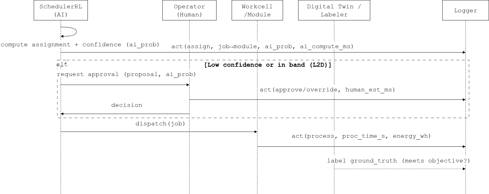

# Smart Manufacturing — Simulation Spec (v0)

**Purpose** (what we compare):
Benchmark Human–AI scheduling for the DFKI SmartFactory “Production Island _KUBA” with a reproducible simulation + metrics workflow.
We compare policies (heuristics, RL, RL+deferral) on identical data and quantify technical and human-in-the-loop (HAIC) outcomes.

- **Scheduling policy quality**: Baseline heuristic vs ABOS-RL (or RL proxy) vs RL + Human-in-the-Loop deferral (L2D-like).

- **Trade-offs**: accuracy (meets objective) vs latency and human load (defer rate).

- **Operator impact**: trust/overrides, cognitive load proxy (HCL), adaptability during the session.

- **(Optional) Fairness / equity**: outcomes per module/vendor/shift.

## Actors & Objects

- `Agents
`
  - `Operator` - `OP` (`human`): can `set_goal`, `approve`, `override`.
  - `SchedulerRL` - `SRL` (`ai`): bid, assign, emits confidence (eg. softmax(Q)).
  - `Machine_i` - `M1...Mk` (`surrogate/ai`): process → `{done/energy/time}`.
  - `QualityControl` - `QC` (`ai/human`): inspect.

- Objects
  - `Job` - `JB`: `order/task` unit with `steps`, `due_date`, `priority`, `status`.
  - `Workcell/Module` - `W*`*: resource that executes a job step.
  - `DigitalTwin` (`DT`, optional object): provides labels/metrics for outcomes.

- Affordances (examples)

  - `SRL`: assign
  - `OP`: approve, override, set_goal
  - `Machine`: process
  - `QC`: inspect

## HITL Workflow (minimal loop)

[](../figures/BS_diagrams-smart_energy.png)

## Policies to compare

1. BaselineThreshold(τ₀)

    - If `ai_prob ≥ τ₀` → **AI assigns**, else **Human decides**.

    - Single knob: `threshold ∈ [0,1]`.

2. **L2D-like(τ)** (uncertainty deferral)

    - If `ai_prob ∈ (1−τ, τ)` → defer to **Human**; else **AI acts**.

    - Knob: `τ ∈ [0.5, 0.99]` (larger → wider deferral band).

3. **(Optional) CostAware(α, β)**
    - Predict composite utility `U = α·on_time_prob − β·energy_norm`, **defer** if |U| < ε (uncertain), else act by sign(U).

## Data Sources (dataset-driven mode)

Minimal CSV (works with your A/B tab mapper):

```bash
job_id, ai_prob, ground_truth, ai_latency_ms, human_latency_ms, module_id, vendor, shift, proc_time_s, energy_wh
J001,   0.78,    on_time,      40,            1200,             M1,       in_house, day, 45,         520
J002,   0.41,    late,         35,            1400,             M2,       external, night, 60,       740
...
```

- **Required**: `ai_prob` (0..1), `ground_truth` (e.g., `on_time`/`late` or `secure`/`insecure`), `job_id`.

- **Optional**: `ai_latency_ms`, `human_latency_ms`, `module_id/vendor/shift` (for fairness), `proc_time_s`, `energy_wh`.

## Metrics of interest

- **Base**: accuracy, defer_rate, avg_latency_ms.

- **HAIC Interaction metrics**: F, D, HCL, Tr, A, S, EL, EfficiencyScore.

- **Fairness**: slices by region, asset_type, weather_regime, time_of_day.

- **Trust/Usability**: SUS + trust item; Operator overrides as proxy for trust.

## Config Skeleton

```json
{
  "sim_id": "pilot_<name>_v0",
  "environment": {"id": "ENV", "class": "base.Environment",
    "attributes": {"task": "<task>", "domain": "<domain>"}},
  "agents": [
    {"id": "H", "class": "base.Agent", "model": "human", "affordances": ["view","classify","approve","reject"]},
    {"id": "AI", "class": "base.Agent", "model": "ai", "affordances": ["classify"]}
  ],
  "objects": [{"id": "X", "class": "base.Object", "affordances": ["view","classify","approve"]}],
  "script": []  // filled via dataset->script or scripted steps
}
```